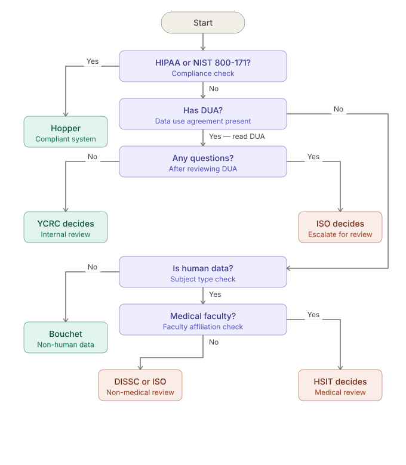

<style>
@import url('https://fonts.googleapis.com/css2?family=Roboto+Slab:wght@400;700&display=swap');
.columns { display: flex; gap: 1em; }
.columns > div { flex: 1; }
section h1, section h2, section h3 { font-family: 'Roboto Slab', serif; }
img[alt~="center"] { display: block; margin: 0 auto; }
header {
  font-family: 'Roboto Slab', serif;
  color: #999;
  font-size: 0.6em;
  width: 100%;
  text-align: right;
  left: 0;
  right: 0;
  padding: 20px 60px 20px 30px;
  box-sizing: border-box;
}
footer {
  font-family: 'Roboto Slab', serif;
  color: #999;
  font-size: 0.6em;
  width: 100%;
  text-align: center;
  left: 0;
  right: 0;
  padding: 0 30px 0px 30px;
  box-sizing: border-box;
}
section::after { font-family: 'Roboto Slab', serif; }
section.lead h1 { font-size: 2.4em; }
section::before {
  content: '';
  background-image: url('images/ycrc-logo-white.png');
  background-size: contain;
  background-repeat: no-repeat;
  position: absolute;
  bottom: 20px;
  left: 30px;
  width: 100px;
  height: 50px;
}

section p, section li, section td, section th {
  font-size: 0.85em;
}
</style>

# Hopper Overview

Rob Bjornson 
Yale Center for Research Computing

---

# Agenda

- **Who was Hopper?**
- **Why do we need Hopper?**
- **Hopper resources**
- **How is Hopper like other YCRC clusters?**
- **How does Hopper differ from other YCRC clusters?**
- **Resources**

---

# Who was Grace Murray Hopper?

<div class="columns">
<div>
  
- Ph.D. in Mathematics from Yale in 1934
- Pioneering computer scientist 
- Trailblazer in creating first compiled computer languages

</div>
<div>


---

# Why do we need Hopper?

- Many datasets now require a higher level of security than Bouchet provides.
  - Data Use Agreements (DUAs)
  - NIH controlled access datasets (e.g. dbGaP)
 
Hopper complies with:
  - NIST 800-171 standard
  - HIPAA standard
  - Can meet other specific DUAs

---

# Hopper's Hardware
- ~6000 cpus
- GPUs
  - 40 a5000
  - 40 l40s
  - 40 a40
  - 40 H200
  - 60 H100
  - _48 B200 coming_
  
VAST 2.4 PiB

[Hopper resources](https://docs.ycrc.yale.edu/clusters/hopper/#partitions-and-hardware)

---

# How is Hopper like other YCRC clusters?

In most ways, Hopper will be familiar to you:
- Slurm jobs
- Partitions: devel, day, week, gpu ... 
- Open On Demand (but inside VDI)
- Software modules
- Home, work, scratch directories
  
---
# How does Hopper differ from other YCRC clusters?
- Getting access
- User Interface (VDI)
- Security measures and rules
- No internet access
- Data transfer
- Software installation
- Usage charges
- Projects, not Groups
- Storage allocations
  
We'll touch on each in turn

---
# Getting access
Access to the system is a multi-step process:
1. PI submits a project https://research.computing.yale.edu/secure-project-request
2. Health Science IT (HSIT) consults with PI and approves request
3. PI completes required security http://research.computing.yale.edu/regulated-research-training
4. YCRC creates new project, PI account, and associated linux group: _netid_projname_
5. Other lab members can join https://research.computing.yale.edu/hopper-account-request

Of note: a PI can and should submit separate project requests for each individual project (e.g. IRB)

---
# User Interface
- Hopper's only user interface is a Virtual Desktop Infrastructure (VDI)
- You _must_ be on the Yale VPN even when on campus
- Two ways to access VDI 
  - Via browser: https://hopper.ycrc.yale.edu
  - Via dedicated ThinLinc client. https://www.cendio.com/thinlinc/download
- You will receive a (silent) DUO prompt each time
- The VDI is the equivalent of a login node
- VDI provides terminal, firefox, Open On Demand
- Session is "persistent" for some period
- Each user has one unique VDI session

---
# Security Measures and Rules

- The VDI prevents copy/pasting to the host computer, prevents file transfers and enforces idle session timeouts.
- Cut/Copy/Paste inside Hopper is allowed (right click + copy/paste)
- External screenshots, screen recording and screen sharing (e.g. via Zoom) are strictly prohibited.
- Internal screenshots can be made with ThinLinc client.
- If you know you will be away from your computer for more than 10 minutes, you must disconnect from the VDI by closing the browser tab or exiting the client.
- You must access Hopper from a private location, such as your home or office. Access from public locations such as coffee shops, transportation hubs or libraries is not allowed.
- Do not put sensitive data (e.g. patient information, personal identifiers) in directory names or job names, which might expose this information.
- Maintenance (usually less than 1 day) is done quarterly.

---


---

# No Internet Access
- From Hopper, you are not able to directly access anything outside of Hopper.
- All file transfers in and out are mediated by YCRC staff
- With some exceptions, all software installs mediated by YCRC staff


---
# Data Transfer
- Moving data into and out of Hopper requires submitting a request
- We distinquish between Low Risk and Sensitive Data
- Low Risk Transfer In or Out: https://research.computing.yale.edu/hopper-low-risk-transfer : scripts, deidentified data, data files with no PHI, PII, etc.
- Sensitive Data Transfer In: https://research.computing.yale.edu/hopper-sensitive-transfer : everything else
- Sensitive Data Transfer Out: contact YCRC

---
# Low Risk Data Transfer steps
1. Use globus to upload your data to your folder in the "Yale CRC Hopper Low Risk" collection.
2. Submit https://research.computing.yale.edu/hopper-low-risk-transfer
3. YCRC will move your data from the collection to your desired location on Hopper
4. Download is the same in reverse

---
# Sensitive Data Transfer In
1. Submit https://research.computing.yale.edu/hopper-sensitive-transfer first.
2. YCRC will approve, make all necessary networking changes, and create a temporary globus receiving collection
3. You will receive instructions on how to transfer your data.

Transfers requiring method other than globus are possible with YCRC assistance.

---

# Sensitive Data Transfer Out 
Transfer of sensitive data out is currently handled on a case-by-case basis.  Please contact YCRC.

---
# Software Installation
- Since you have no internet access, most download and installation of software must be done by YCRC.
- The applications will generally be made available as modules.
  
There are two exceptions allowing self-service: 
- python packages from the default anaconda repo.  Note: NOT conda-forge

```
module load miniconda
conda create/install ...
```
 
- many approved R packages from CRAN.  Use `install.packages()`

For all other software, first search the modules, then contact YCRC.

---

## What about your own code?
You may transfer in scripts.  You may transfer in and compile code written by you or others in your lab. 
This is considered a low risk transfer.

You may NOT transfer in and compile code written elsewhere.  Ask us to download and build it for you.

---

# Usage Charges
Unlike YCRC's other clusters, currently _all_ use of Hopper incurs compute charges.  

Current Rates:

type | cost/hour
---- | -----
CPUs | $0.004
mid-range GPU | $0.49
H200/B200 | $0.99-1.49

Storage beyond free quota: $5.15/TiB/month

See https://docs.ycrc.yale.edu/clusters/hopper/#rate-structure

---
# Projects, not Groups
Accounts on Hopper are subtly different from other YCRC clusters
- Each logical _Project_ is set up independently, with its own linux group and membership
- Projects are intended to be impermanent.  Once the research project is complete, the project is terminated
- Projects must be reauthorized annually.
- PIs can and should have multiple Hopper projects if working on unrelated research projects
- Each project has its own work and scratch directories
- However, each user has a single home directory

---

# Storage Allocations
space | size | snapshots
------|------|---------
home | 125 GiB | 7 days
work | 1 TiB | 7 days
scratch | 10 TiB | NO
PI | charged | NO

Aside from the snapshots, _no data is backed up!_

---
# Getting help

- Hopper doc https://docs.ycrc.yale.edu/clusters/hopper
- Reach out to YCRC: email ycrc@yale.edu
- Hopper-specific Office Hours https://yale.zoom.us/my/ycrcsupport: Thurs 2-3pm 
- _Please do not send us screen shots!_
- We cannot view your screen over zoom.  Instead, we can join your VDI session
 
---

<!-- _footer: "" -->

# Workshop Feedback

Please help us improve this workshop by sharing feedback via a 2-minute anonymous survey. Thank you.

For access: click the link or scan the QR Code:
https://yalesurvey.ca1.qualtrics.com/jfe/form/SV_ac86jTriewu9l8W

 

---

<!-- _class: lead -->

# Questions?

Thank you!

Any remaining time can be used for additional questions and office hours.
